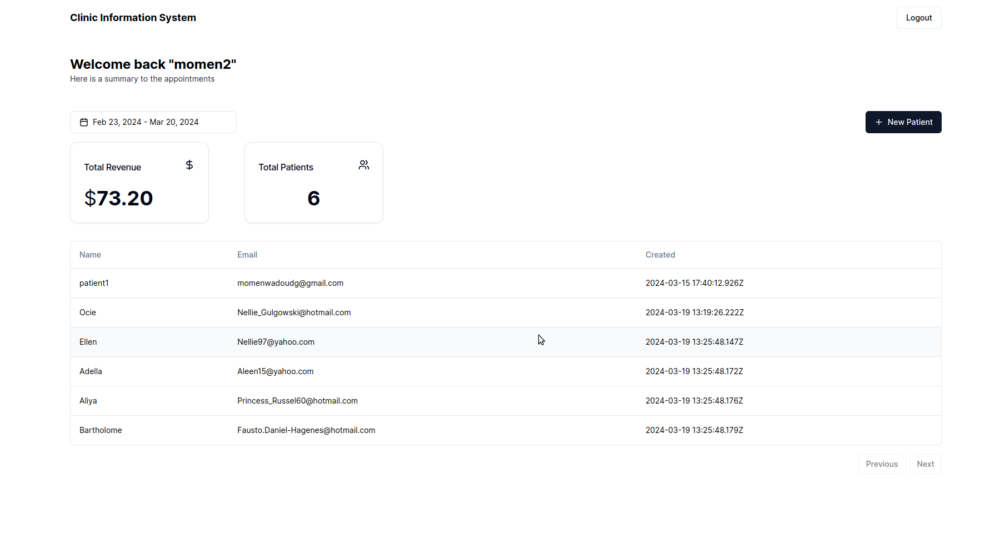
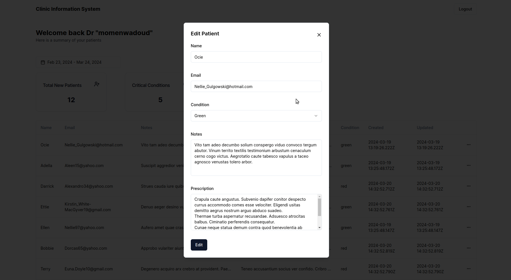

# Clinic Information System

A clinic information system dashboard that is used by clinic employees to manage patients records with medical prescription and has 3 types of users:

1. Doctors
2. Accountants
3. Pharmacist

All patients' medical records will be stored in a database that has authentication and authorization limitations. Users can use a date range picker to filter the data.

## Tools used:

1. NextJS 14
2. TailwindCSS
3. Shadcn UI
4. Pocketbase database & authentication

## Screenshots

## What I learned:

1. NextJS 14 new server components APIs
2. Shadcn UI
3. Database access rules and authorization

## How to install locally?

1. `git clone https://github.com/MomenAbdelwadoud/clinic-IS.git`
2. Open the folder and `bun add` to install the dependencies
3. Download pocketbase to the project root folder ([pocketbase installation](https://pocketbase.io/docs/))
4. Run `./pocketbase serve` and go to admin dashboard (http://127.0.0.1:8090/_)
5. In the admin dashboard go to settings -> import collections -> load from JSON file and upload `pb_schema.json` in the root directory.
6. Run `bun dev` in a new terminal and go to `http://localhost:3000/` and sign-up as a new user.
7. Run `bun run ./lib/generateRandomPatients.ts` to generate random patients data (You have to have a doctor user in the DB).
